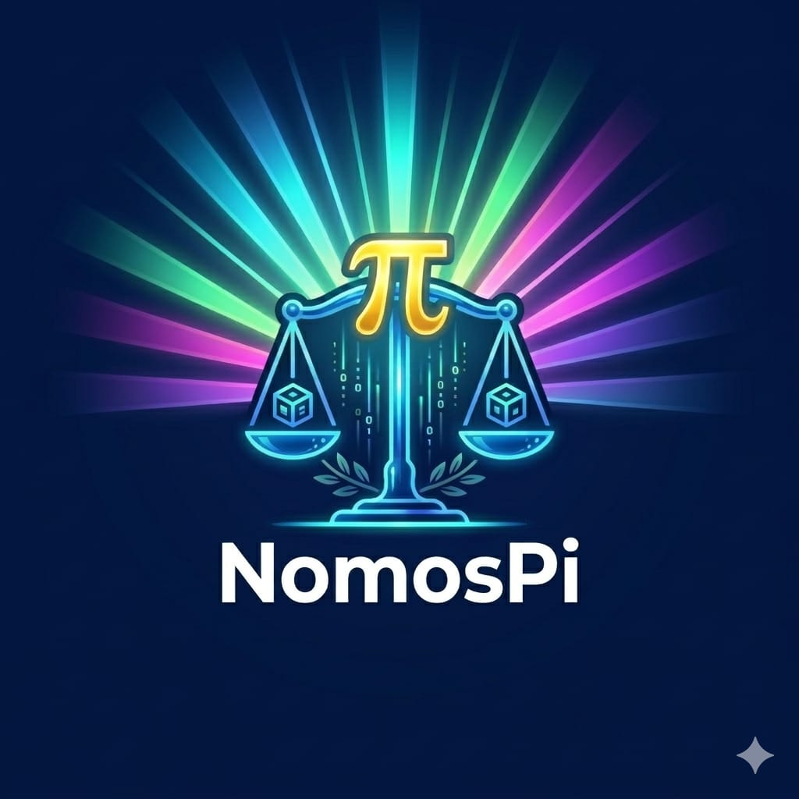

# NomosPi Official Project ⚖️
> [!IMPORTANT]
> **Note for Mobile Users:** If the Whitepaper PDF does not display, please **Download** it or switch your browser to **"Desktop Site"** mode.
> 
> **ملاحظة لمستخدمي الهاتف:** إذا لم يظهر ملف الورقة البيضاء (PDF)، يرجى **تحميله** أو تحويل المتصفح إلى وضع **"موقع سطح المكتب"**.

## 🎨 Visual Identity (Vision)
​

### Vision Description:
The visual identity of **NomosPi** represents the perfect equilibrium between justice and digital innovation. 

**Key Symbolic Elements:**
* **The Scales:** Symbolize the rule of law (Nomos) and stability in the digital economy.
* **The Golden Pi:** Represents the integration with the Pi Network and premium value.
* **The Digital Cubes:** Symbolize blockchain security, transparency, and data integrity.
* **The Radiant Light:** Symbolizes a futuristic, inclusive, and transparent global vision.

---
© 2026 NomosPi - Secure & Strategic Ecosystem.
